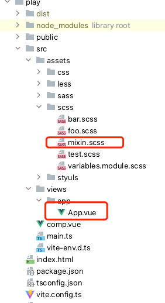

# unplugin-vue-cssvars
🌀 一个 vue3 的插件能够能让你在 css 文件中使用 CSSVars 特性

[English](https://github.com/baiwusanyu-c/unplugin-vue-cssvars/blob/master/README.md) | 中文

## Feature

* 🧩 它是一个 vue 的功能扩展，让你能够在 css 文件中使用 v-bind
* 🌈 支持全平台打包工具构建（vite、webpack）
* ⛰ 支持 css, sass, scss, less, stylus
*  ⚡ 轻量且快速

## Core Strategy
1. 在使用开发服务器时，`unplugin-vue-cssvars`会从组件开始分析引用的css文件，
并在`@vitejs/plugin-vue` 的转换代码中进行注入样式
2. 在打包时`unplugin-vue-cssvars`会从组件开始分析引用的css文件，并将其注入到
sfc 中，别担心会产生多余的代码，打包工具（例如 vite）会自动处理它。

## Install

```bash
npm i unplugin-vue-cssvars -D
```
或
```bash
yarn add unplugin-vue-cssvars -D
```
或
```bash
pnpm add unplugin-vue-cssvars -D
```

## Usage
1. 使用插件并配置
<details>
<summary>Vite</summary>

```ts
// vite.config.ts
import { defineConfig } from 'vite'
import { viteVueCSSVars } from 'unplugin-vue-cssvars'
import vue from '@vitejs/plugin-vue'
import type { PluginOption } from 'vite'
export default defineConfig({
  plugins: [
    vue(),
    viteVueCSSVars({
      include: [/.vue/],
      includeCompile: ['**/**.scss'],
      server: false,
    }) as PluginOption,
  ],
})
```

</details>
<br>
<details>
<summary>Rollup</summary>

```ts
// rollup.config.js
import { rollupVueCSSVars } from 'unplugin-vue-cssvars'
export default {
  plugins: [
    rollupVueCSSVars(/* options */),
  ],
}
```

</details>
<br>
<details>
<summary>Webpack</summary>

```ts
// webpack.config.js
module.exports = {
  /* ... */
  plugins: [
    require('unplugin-vue-cssvars').webpackVueCSSVars({ /* options */ }),
  ],
}
```
</details>
<br>
<details>
<summary>Vue CLI</summary>

```ts
// vue.config.js
module.exports = {
  configureWebpack: {
    plugins: [
      require('unplugin-vue-cssvars').webpackVueCSSVars({ /* options */ }),
    ],
  },
}
```

</details>
<br>
<details>
<summary>ESBuild</summary>

```ts
// esbuild.config.js
import { build } from 'esbuild'
import { esbuildVueCSSVars } from 'unplugin-vue-cssvars'

build({
  plugins: [esbuildVueCSSVars(/* options */)],
})
```
</details>

2. 使用 `v-bind-m`
```
// foo.css
.foo{
   color: v-bind-m(fontColor)
}
```
3. 使用别名   

例如你有以下项目结构：  



 ```
// App.vue
<template>
  <div class="scss">
    app
  </div>
</template>

<style lang="scss" scoped>
@import '@/assets/scss/mixin';
</style>

```

那么你可以这样配置

```
// vite.config.ts
import { resolve } from 'path'
import { defineConfig } from 'vite'
import vue from '@vitejs/plugin-vue'
import { viteVueCSSVars } from '../dist'
export default defineConfig({
  resolve: {
    alias: {
      '@': resolve(__dirname, './src'),
    },
  },
  plugins: [
    vue(),
    viteVueCSSVars({
      include: [/.vue/],
      includeCompile: ['**/**.scss'],
      alias: {
        '@': resolve(__dirname, './src'),
      },
    }),
  ],
})

````

## Option

```typescript
export interface Options {
  /**
   * 需要转换的路径，默认是项目根目录
   * @default process.cwd()
   */
  rootDir?: string
   
  /**
   * 需要转换的文件名后缀列表（目前只支持.vue）RegExp or glob
   */
  include?: FilterPattern

  /**
   * 不需要转换的文件名后缀列表（目前只支持.vue）RegExp or glob
   */
  exclude?: FilterPattern

  /**
   * `unplugin-vue-cssvars` 只是做了样式提升注入，其编译依旧依赖于 `@vue/compiler-dom`
   * 在某些时候可能会生成重复的 `css` 代码(一般不会，因为打包时会将重复代码删除)，例如 `vite` 中关闭构建
   * 时压缩选项，`revoke` 则可以在打包时将注入的代码删除
   */
  revoke?: boolean

   /**
    * 选择需要处理编译的文件，默认是css
    * 例如：如果你想要处理.scss文件，那么你可以传入 ['** /**.sass']
    * @property { ['** /**.css', '** /**.less', '** /**.scss', '** /**.sass', '** /**.styl'] }
    * @default ['** /**.css']
    */
   includeCompile?: Array<string>
   
   /**
    * 标记是否为开发服务器使用
    * 因为 unplugin-vue-cssvars 在开发服务器上和打包中使用了不同策略,
    * vite 中如果不传递它，unplugin-vue-cssvars 将自动识别 config 的 command 来决定 server 值
    * @default true
    */
   server?: boolean
}
```

## Tips

### ● 转换分析时的约定规则
1. `sfc` 中，如果 `@import` 指定了后缀，则根据后缀的文件进行转换分析，否则根据当前 `script` 标签的 `lang` 属性（默认 `css` ）进行转换分析
2. `css` 中规则：`css` 文件只能引用 `css` 文件，只会解析 `css` 后缀的文件。
3. `scss`、`less`、`stylus` 中规则：`scss`、`less`、`stylus文件可以引用` `css` 文件、以及对应的 `scss` 或 `less` 文件或 `stylus` 文件，  
   优先对预处理器后缀的文件进行转换分析，如果文件不存在，则对其 `css` 文件进行分析

### ● sfc 中变量提取规则
1. 对于 `script setup`, `unplugin-vue-cssvars` 会提取所有变量进行匹配。
````
<script setup>
    const color = 'red'
</script>
````
2. 对于 `composition api`, `unplugin-vue-cssvars` 会提取 `setup` 函数返回变量进行匹配。
````
<script>
 export default {
   setup(){
       const color = 'red'
       return {
          color
       }
   }
}
</script>
````
3. 对于 `options api`, `unplugin-vue-cssvars` 会提取 `data` 函数返回变量进行匹配。
````
<script>
 export default {
   data(){
       const color = 'red'
       return {
          color
       }
   }
}
</script>
````
4. 对于普通的 `script`, `unplugin-vue-cssvars` 会提取所有变量进行匹配。
````
<script>
    const color = 'red'
</script>
````

### ● sfc 中变量冲突规则
1. `sfc` 中有 `options api` 与 `composition api`, 所有变量会进行合并
变量出现冲突以后面出现的（比如先写了 `options api`，后写 `composition api`，以 `composition api` 优先）优先
2. `sfc` 中有  `script setup`、`options api` 与 `composition api`,  所有变量会进行合并，变量出现冲突以`script setup`优先
3. `sfc` 中普通的 `script`，不会与`options api` 、 `composition api`同时存在
4. `sfc` 中普通的 `script`若存在，则必存在`script setup`
5. `sfc` 中普通的 `script`与 `script setup` 所有变量会进行合并,变量出现冲突以`script setup`优先

### ● 样式提升后的优先级
1. 从 `sfc` 开始，分析 `style` 标签中引用的 `css` 文件，按照 `css` 文件中的引用顺序，深度优先依次提升并注入到 `sfc` 中。
2. 注入到 `sfc` 后，其优先级完全由 `@vue/compiler-dom` 的编译器决定。

## Thanks
* [vue](https://github.com/vuejs/core)
* [vite](https://github.com/vitejs/vite)
* [unplugin](https://github.com/unjs/unplugin)
