# unplugin-vue-cssvars
🌀 一个 vue3 的插件能够能让你在 css 文件中使用 CSSVars 特性

[English](https://github.com/baiwusanyu-c/unplugin-vue-cssvars/blob/master/README.md) | 中文

## Feature

* 🧩 它是一个 vue 的功能扩展，让你能够在 css 文件中使用 v-bind
* 🌈 支持全平台打包工具构建
* ⛰ 支持 css, sass, scss, less, stylus
*  ⚡ 轻量且快速

## Core Process

```mermaid
graph LR  
A[vite] -- plugin --> B((unplugin-vue-cssvars))
B -- 1.预处理项目中css文件 --> C(生成CSS Module Map获得包含 v-bind 的 css 代码等信息)  
C --> D
B -- 2.基于步骤1与vue编译器 --> D(根据 SFC 组件信息获得其引用的 CSS Module)
D --> E
B -- 3.基于vue编译器 --> E(提取 SFC 组件变量)
E --> F
B -- 4.注入提升代码 --> F(匹配CSS Module 与 SFC 变量注入代码)
F --> G((vitejs/plugin-vue))
```



## Install

```bash
npm i unplugin-vue-cssvars -D
```
或
```bash
yarn add unplugin-vue-cssvars -D
```
或
```bash
pnpm add unplugin-vue-cssvars -D
```

## Usage
<details>
<summary>Vite</summary>

```ts
// vite.config.ts
import { resolve } from 'path'
import { defineConfig } from 'vite'
import { viteVueCSSVars } from 'unplugin-vue-cssvars'
import type { PluginOption } from 'vite'
export default defineConfig({
  plugins: [
    viteVueCSSVars(/* options */) as PluginOption,
  ],
})
```

</details>
<br>
<details>
<summary>Rollup</summary>

```ts
// rollup.config.js
import { resolve } from 'path'
import { rollupVueCSSVars } from 'unplugin-vue-cssvars'
export default {
  plugins: [
    rollupVueCSSVars(/* options */),
  ],
}
```

</details>
<br>
<details>
<summary>Webpack</summary>

```ts
// webpack.config.js
module.exports = {
  /* ... */
  plugins: [
    require('unplugin-vue-cssvars').webpackVueCSSVars({ /* options */ }),
  ],
}
```
</details>
<br>
<details>
<summary>Vue CLI</summary>

```ts
// vue.config.js
module.exports = {
  configureWebpack: {
    plugins: [
      require('unplugin-vue-cssvars').webpackVueCSSVars({ /* options */ }),
    ],
  },
}
```

</details>
<br>
<details>
<summary>ESBuild</summary>

```ts
// esbuild.config.js
import { build } from 'esbuild'
import { esbuildVueCSSVars } from 'unplugin-vue-cssvars'

build({
  plugins: [esbuildVueCSSVars(/* options */)],
})
```
</details>

## Option

```typescript
export interface Options {
  /**
   * 需要转换的路径，默认是项目根目录
   * @default process.cwd()
   */
  rootDir?: string
  /**
   * 需要转换的文件名后缀列表（目前只支持.vue）RegExp or glob
   */
  include?: FilterPattern

  /**
   * 不需要转换的文件名后缀列表（目前只支持.vue）RegExp or glob
   */
  exclude?: FilterPattern

  /**
   * `unplugin-vue-cssvars` 只是做了样式提升注入，其编译依旧依赖于 `@vue/compiler-dom`
   * 在某些时候可能会生成重复的 `css` 代码(一般不会，因为打包时会将重复代码删除)，例如 `vite` 中关闭构建
   * 时压缩选项，`revoke` 则可以在打包时将注入的代码删除
   */
  revoke?: boolean
}
```
### 关于 revoke 详细说明
> 💡 正式版本以解决重复代码问题，正式版本不再需要设置

有如下两个文件 `App.vue` 和 `test.css`
````
<script setup lang="ts">
    const color = 'red'
</script>

<template>
  <div class="test">
    TEST
  </div>
</template>

<style scoped>
@import "./assets/test";
</style>

````
````
/** test.css **/
div {
    color: v-bind(color);
}
````
当未使用 `unplugin-vue-cssvars` 使用 `vite` 构建后
````
/** test.css **/
div[data-v-2e7c9788] {
    color: var(--8bcabd20);
}
````
其中 `color: var(--8bcabd20);` 的哈希并不会出现在组件打包产物中，因为 `vue` 不支持在文件中使用 `v-bind`。  
当使用 `unplugin-vue-cssvars` 使用 `vite` 构建后（`minify: false`）
````
/** test.css **/
div[data-v-1dfefb04] {
    color: var(--516b0d4a);
}

/* created by @unplugin-vue-cssvars */
/* <inject start> */
div[data-v-1dfefb04]{color:var(--516b0d4a)}
/* <inject end> */
````
可以看到通过 `unplugin-vue-cssvars` 会生成注入代码，并且依赖于 `@vue/compiler-dom`，其哈希值能够出现在组件打包产物中。  
但是观察发现，这段代码是重复的。因此，开启 `revoke` 选项，将移除重复代码
````
/** test.css **/
div[data-v-1dfefb04] {
    color: var(--516b0d4a);
}
````

## Tips

### ● 转换分析时的约定规则
1. `sfc` 中，如果 `@import` 指定了后缀，则根据后缀的文件进行转换分析，否则根据当前 `script` 标签的 `lang` 属性（默认 `css` ）进行转换分析
2. `css` 中规则：`css` 文件只能引用 `css` 文件，只会解析 `css` 后缀的文件。
3. `scss`、`less`、`stylus` 中规则：`scss`、`less`、`stylus文件可以引用` `css` 文件、以及对应的 `scss` 或 `less` 文件或 `stylus` 文件，  
   优先对预处理器后缀的文件进行转换分析，如果文件不存在，则对其 `css` 文件进行分析

### ● sfc 中变量提取规则
1. 对于 `script setup`, `unplugin-vue-cssvars` 会提取所有变量进行匹配。
````
<script setup>
    const color = 'red'
</script>
````
2. 对于 `composition api`, `unplugin-vue-cssvars` 会提取 `setup` 函数返回变量进行匹配。
````
<script>
 export default {
   setup(){
       const color = 'red'
       return {
          color
       }
   }
}
</script>
````
3. 对于 `options api`, `unplugin-vue-cssvars` 会提取 `data` 函数返回变量进行匹配。
````
<script>
 export default {
   data(){
       const color = 'red'
       return {
          color
       }
   }
}
</script>
````
4. 对于普通的 `script`, `unplugin-vue-cssvars` 会提取所有变量进行匹配。
````
<script>
    const color = 'red'
</script>
````

### ● sfc 中变量冲突规则
1. `sfc` 中有 `options api` 与 `composition api`, 所有变量会进行合并
变量出现冲突以后面出现的（比如先写了 `options api`，后写 `composition api`，以 `composition api` 优先）优先
2. `sfc` 中有  `script setup`、`options api` 与 `composition api`,  所有变量会进行合并，变量出现冲突以`script setup`优先
3. `sfc` 中普通的 `script`，不会与`options api` 、 `composition api`同时存在
4. `sfc` 中普通的 `script`若存在，则必存在`script setup`
5. `sfc` 中普通的 `script`与 `script setup` 所有变量会进行合并,变量出现冲突以`script setup`优先

### ● 样式提升后的优先级
1. 从 `sfc` 开始，分析 `style` 标签中引用的 `css` 文件，按照 `css` 文件中的引用顺序，深度优先依次提升并注入到 `sfc` 中。
2. 注入到 `sfc` 后，其优先级完全由 `@vue/compiler-dom` 的编译器决定。

## Thanks
* [vue](https://github.com/vuejs/core)
* [vite](https://github.com/vitejs/vite)
* [unplugin](https://github.com/unjs/unplugin)
