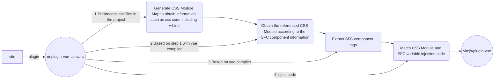

# unplugin-vue-cssvars
🌀 A vue plugin that allows you to use vue3's CSSVars feature in css files

English | [中文](https://github.com/baiwusanyu-c/unplugin-vue-cssvars/blob/master/README.ZH-CN.md)

## Feature

* 🧩 It is a function extension of vue
* 🌈 Compatible with multiple bundled platforms（vite、rollup、esbuild、webpack）
* ⛰ Support css, sass, scss, less, stylus
*  ⚡ light and fast

## Core Process



## Install

```bash
npm i unplugin-vue-cssvars -D
```
Or
```bash
yarn add unplugin-vue-cssvars -D
```
Or
```bash
pnpm add unplugin-vue-cssvars -D
```

## Usage
<details>
<summary>Vite</summary>

```ts
// vite.config.ts
import { resolve } from 'path'
import { defineConfig } from 'vite'
import { viteVueCSSVars } from 'unplugin-vue-cssvars'
import type { PluginOption } from 'vite'
export default defineConfig({
  plugins: [
    viteVueCSSVars(/* options */) as PluginOption,
  ],
})
```

</details>
<br>
<details>
<summary>Rollup</summary>

```ts
// rollup.config.js
import { resolve } from 'path'
import { rollupVueCSSVars } from 'unplugin-vue-cssvars'
export default {
  plugins: [
    rollupVueCSSVars(/* options */),
  ],
}
```

</details>
<br>
<details>
<summary>Webpack</summary>

```ts
// webpack.config.js
module.exports = {
  /* ... */
  plugins: [
    require('unplugin-vue-cssvars').webpackVueCSSVars({ /* options */ }),
  ],
}
```
</details>
<br>
<details>
<summary>Vue CLI</summary>

```ts
// vue.config.js
module.exports = {
  configureWebpack: {
    plugins: [
      require('unplugin-vue-cssvars').webpackVueCSSVars({ /* options */ }),
    ],
  },
}
```

</details>
<br>
<details>
<summary>ESBuild</summary>

```ts
// esbuild.config.js
import { build } from 'esbuild'
import { esbuildVueCSSVars } from 'unplugin-vue-cssvars'

build({
  plugins: [esbuildVueCSSVars(/* options */)],
})
```
</details>

## Option

```typescript
export interface Options {
   /**
    * Provide path which will be transformed
    *
    * @default process.cwd()
    */
   rootDir?: string
   /**
    * RegExp or glob to match files to be transformed
    */
   include?: FilterPattern

   /**
    * RegExp or glob to match files to NOT be transformed
    */
   exclude?: FilterPattern

   /**
    * unplugin-vue-cssvars depends on the vue compiler,
    * there may be duplicate css after packaging, here we clear it
    */
   revoke?: boolean

   /**
    * preprocessor
    * the unplugin-vue-cssvars package does not integrate a preprocessor,
    * when you want to use unplugin-vue-cssvars in the preprocessor file,
    * please pass the preprocessor to unplugin-vue-cssvars
    * @property { sass | less | stylus }
    */
   preprocessor?: PreProcessor

   /**
    * Specify the file to be compiled, for example,
    * if you want to compile scss, then you can pass in ['** /**.sass']
    * @property { ['** /**.css', '** /**.less', '** /**.scss', '** /**.sass', '** /**.styl'] }
    * @default ['** /**.css']
    */
   includeCompile?: Array<string>
}
```
### use preprocessor
the `unplugin-vue-cssvars` package does not integrate a preprocessor,
when you want to use `unplugin-vue-cssvars` in the preprocessor file,
please pass the preprocessor to `unplugin-vue-cssvars`

````typescript
// vite.config.ts
import { defineConfig } from 'vite'
import { viteVueCSSVars } from 'unplugin-vue-cssvars'
import sass from 'sass'
import type { PluginOption } from 'vite'
export default defineConfig({
  plugins: [
    viteVueCSSVars({
       preprocessor: { sass },
       includeCompile: ['**/**.css', '**/**.scss'],
     }) as PluginOption,
  ],
})
````
In the above example, if your project uses `scss`, then you need to configure `preprocessor: { sass }`,
It is worth noting that you also need to configure `includeCompile: ['**/**.css', '**/**.scss']`,
Because it is entirely up to you to read which files (.sass or .less, or .styl) to use `unplugin-vue-cssvars`.

### Details about revoke
> 💡 v1.0.0 version to solve the problem of duplicate code, no longer need to set

Suppose there are two files `App.vue` and `test.css`
````
<script setup lang="ts">
    const color = 'red'
</script>

<template>
  <div class="test">
    TEST
  </div>
</template>

<style scoped>
@import "./assets/test";
</style>

````
````
/** test.css **/
div {
    color: v-bind(color);
}
````
After building with `vite` when `unplugin-vue-cssvars` is not used
````
/** test.css **/
div[data-v-2e7c9788] {
    color: var(--8bcabd20);
}
````
Among them, the hash of `color: var(--8bcabd20);` will not appear in the component packaging product, because `vue` does not support the use of `v-bind` in the file.
When built with `vite` using `unplugin-vue-cssvars` (`minify: false`)
````
/** test.css **/
div[data-v-1dfefb04] {
    color: var(--516b0d4a);
}

/* created by @unplugin-vue-cssvars */
/* <inject start> */
div[data-v-1dfefb04]{color:var(--516b0d4a)}
/* <inject end> */
````
It can be seen that the code will be injected through `unplugin-vue-cssvars`, and it depends on `@vue/compiler-dom`, whose hash value can appear in the component packaging product.
But observation found that this code is repetitive. 
Therefore, turning on the `revoke` option will remove duplicate code
````
/** test.css **/
div[data-v-1dfefb04] {
    color: var(--516b0d4a);
}
````

## Tips

### ● Rules When Transforming Analysis
1. In `sfc`, if `@import` specifies a suffix, the conversion analysis will be performed according to the suffix file, 
otherwise the conversion analysis will be performed according to the `lang` attribute of the current `script` tag (default `css`)
2. Rules in `css`: `css` files can only reference `css` files, and only files with `css` suffixes will be parsed.
3. Rules in `scss`, `less`, `stylus`: `scss`, `less`, `stylus` files can refer to` `css` files, and corresponding `scss` or `less` files or `stylus` files,
   Prioritize conversion analysis of files with preprocessor suffixes, if the file does not exist, analyze its `css` file

### ● Variable extraction rules in SFC
1. For `script setup`, `unplugin-vue-cssvars` will extract all variables to match.
````
<script setup>
    const color = 'red'
</script>
````
2. For `composition api`, `unplugin-vue-cssvars` will extract `setup` function return variables for matching.
````
<script>
 export default {
   setup(){
       const color = 'red'
       return {
          color
       }
   }
}
</script>
````
3. For `options api`, `unplugin-vue-cssvars` will extract `data` function return variables for matching.
````
<script>
 export default {
   data(){
       const color = 'red'
       return {
          color
       }
   }
}
</script>
````
4. For normal `script`, `unplugin-vue-cssvars` will extract all variables to match.
````
<script>
    const color = 'red'
</script>
````

### ● Variable conflict rules in SFC
1. In sfc, there are options API and composition API, and all variables will be merged. If there are conflicts in variables, 
the syntax that appears later will take precedence
(for example, if options API is written first and composition API is written later, composition API takes precedence).
2. There are `script setup`, `options api` and `composition api` in `sfc`, all variables will be merged, 
if there is a variable conflict, `script setup` will take precedence
3. Ordinary `script` in `sfc` will not exist at the same time as `options api` and `composition api`
4. If the normal `script` exists in `sfc`, there must be `script setup`
5. Common `script` and `script setup` variables in `sfc` will be merged, 
if there is a variable conflict, `script setup` will take precedence

### ● Priority after style injection
1. Starting from `sfc`, analyze the `css` files referenced in the `style` tag, and in accordance with the order of references in the `css` files, they will be promoted in depth-first order and injected into `sfc`.
2. After being injected into `sfc`, its priority is completely determined by the compiler of `@vue/compiler-dom`.

## Thanks
* [vue](https://github.com/vuejs/core)
* [vite](https://github.com/vitejs/vite)
* [unplugin](https://github.com/unjs/unplugin)
